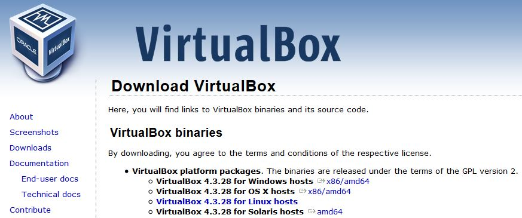
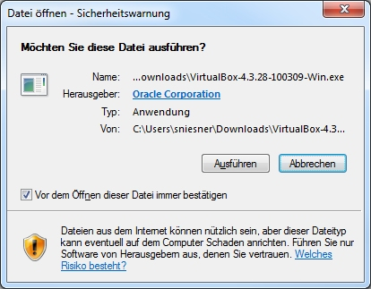
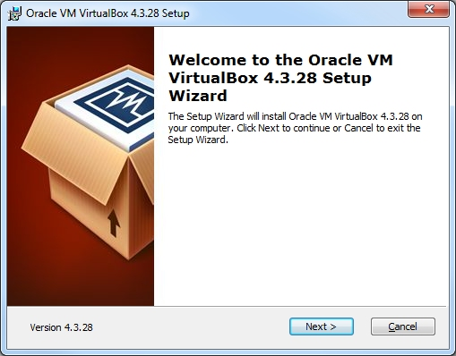
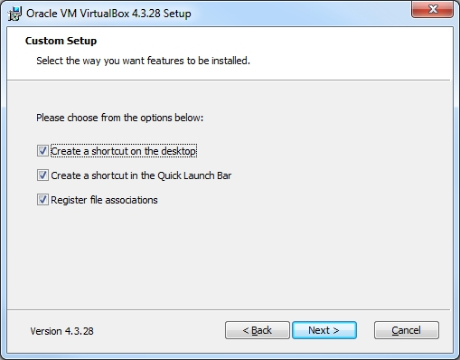
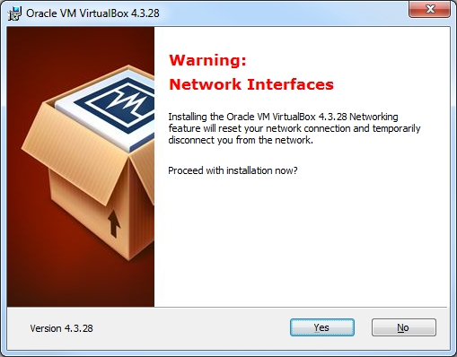
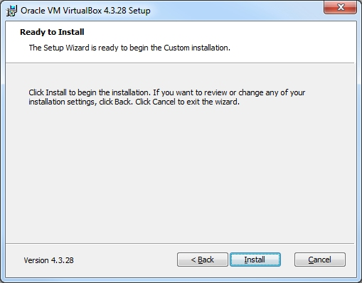
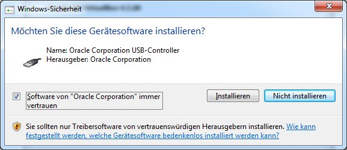
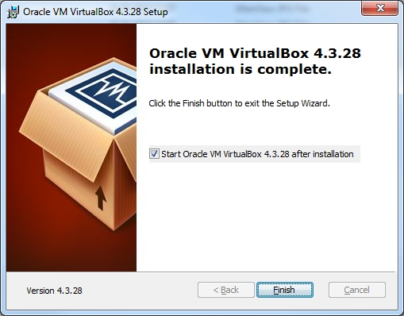

# Installation von VirtualBox

Eine gängige Software zum Betrieb Virtueller Maschinen ist die Freeware VirtualBox von Oracle. Die aktuelle Version ist 4.3.28. In den folgenden Schritten laden Sie die Software herunter und installieren diese auf Ihrem Rechner.

Die gezeigten Abbildungen wurden unter Windows 7 erstellt.

## Download der Datei für die Installation

Öffnen Sie in Ihrem Browser die Internetseite von VirtualBox:

<https://www.virtualbox.org/wiki/Downloads>

Wählen Sie den Eintrag „VirtualBox binaries &gt; VirtualBox platform
packages &gt; VirtualBox 4.3.28 for Windows hosts“:

Laden Sie die Installationsdatei auf Ihren Desktop herunter.

## Installation der Software

Starten Sie die Installation durch einen Doppelklick auf die Installationsdatei.

Es erscheint eine Sicherheitswarnung von Windows:

Klicken Sie „Ausführen“ an.

Es erscheint ein Dialog zur Begrüßung:

Klicken Sie „Next“ an.

In diesem Dialog können Sie die zu installierenden Elemente näher bestimmen:

Die Voreinstellung muss i.d.R. nicht geändert werden.
Klicken Sie „Next“ an.

Im nächsten Dialog können Sie verschiedene Optionen auswählen.

Sie können wählen, ob das Symbol zum Start von VirtualBox auf dem Desktop und in der Schnellstartleiste („Quick Launch Bar“) angezeigt werden soll. Zusätzlich können bestimmte Dateiendungen mit VirtualBox verknüpft werden. Sie sollten mindestens diese letzte Einstellung („Register file associations“) auswählen.
Klicken Sie anschließend „Next“ an.

Es erscheint eine Warnung:

Diese informiert darüber, dass während der Installation die Internetverbindung des Rechners für kurze Zeit zurückgesetzt wird. Dies ist während der Installation notwendig.

  --------- ------------------------------------------------------------------------------------------------------------------------------------
  **!!!**   Stellen Sie sicher, dass Sie Ihre Internetverbindung während der Installation nicht aktiv - beispielsweise für Downloads – nutzen.
  --------- ------------------------------------------------------------------------------------------------------------------------------------

Klicken Sie „Yes“ an.

Die Installation kann nun gestartet werden:

Wenn Sie noch Änderungen vornehmen möchten, klicken Sie „Back“ an.
Klicken Sie „Install“ an, um die Installation zu starten.

Nun beginnt die eigentliche Installation.

Nach kurzer Zeit öffnet sich ein Dialog der Benutzerkontensteuerung von Windows:

Möglicherweise müssen Sie zusätzlich die Zugangsdaten eines Administrators eingeben.
Klicken Sie anschließend „Ja“ an.

Es folgt eine Sicherheitswarnung:

Setzen Sie den Haken vor „Software von Oracle Corporation immer vertrauen“.
Klicken Sie anschließend „Installieren“ an.

Nun wird der Abschluss der Installation gemeldet:

Klicken Sie „Finish“ an.

Wenn Sie den Haken vor „Start Oracle VM VirtualBox 4.3.28 after installation“ nicht entfernt haben, wird VirtualBox nun direkt gestartet.