# Installation von Linux

VuFind kann unter der Betriebssystemen Windows und Linux installiert werden. Ursprünglich wurde VuFind für den Betrieb unter Linux entwickelt und die Installation unter Linux ist daher einfacher.

Die unterschiedlichen Versionen von Linux-Betriebssystemen werden Distributionen genannt. Eine gängige Distribution ist Ubuntu. Ubuntu gibt es in verschiedenen Varianten, welche sich vor allem durch die mitgelieferte Software und die Nutzung von Computerressourcen wie Prozessorleistung und Arbeitsspeicher unterscheiden. Eine ressourcenschonende Variante ist Xubuntu. Dieses werden wir in der aktuellen Version Xubuntu 14.04.2 LTS als Virtuelle Maschine in VirtualBox installieren.

## Download der Datei für die Installation

Öffnen Sie in Ihrem Browser die Internetseite von Ubuntu:
<http://cdimages.ubuntu.com/xubuntu/releases/trusty/release/>

Wählen Sie den Eintrag „Select an image &gt; Desktop image &gt; PC (Intel x86) desktop image“:

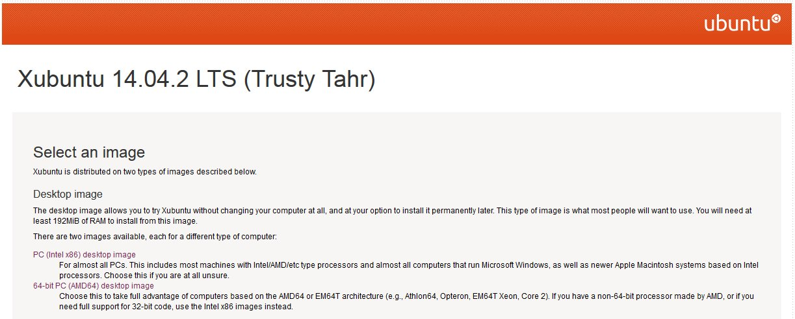


  --------- ------------------------------------------------------------------------------------------------------------------
  **!!!**   Den Eintrag „PC (Intel x86) desktop image“ gibt es auf der Seite zweimal. Sie müssen den oberen davon auswählen.
  --------- ------------------------------------------------------------------------------------------------------------------

Laden Sie die Installationsdatei auf Ihren Desktop herunter.

## Virtuelle Maschine erzeugen

Starten Sie VirtualBox:

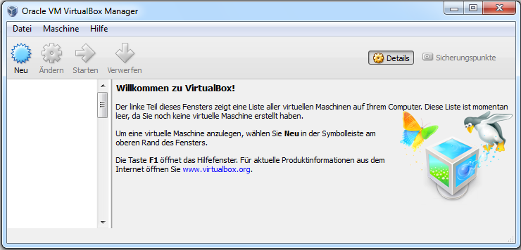

Klicken Sie „Neu“ an.

Es öffnet sich der Dialog zur Erzeugung einer neuen Virtuellen Maschine:

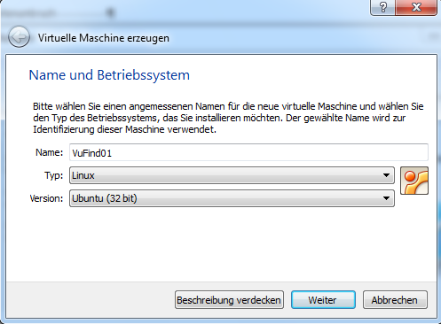

Geben Sie der Virtuellen Maschine einen Namen (hier „VuFind01“). Wählen Sie als Typ „Linux“ und als Version „Ubuntu (32 bit)“ aus.

Klicken Sie anschließend „Weiter“ an.

Die Speichergröße wird abgefragt:


Die Anzeige orientiert sich am Hauptspeicher Ihres Rechners – dieser wird aus Sicht von VirtualBox als Host bezeichnet. Der in der Abbildung gezeigte Rechner hat einen Hauptspeicher von 4 Gigabyte. Der grüne Balken zeigt die maximal empfohlene Größe an.
Wählen Sie einen Wert, der nahe der maximal empfohlenen Größe ist.
Klicken Sie anschließend „Weiter“ an (nicht im Bild zu sehen).

Die Einstellungen für die Festplatte der Virtuellen Maschine werden abgefragt:


Wählen Sie „Festplatte“ erzeugen aus.
Klicken Sie anschließend „Erzeugen“ an (nicht im Bild zu sehen).

Legen Sie den Dateityp der virtuellen Festplatte fest:

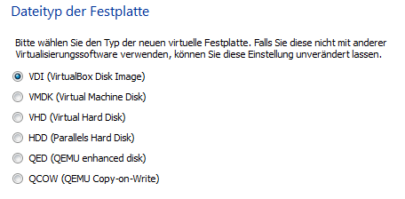

Wählen Sie „VDI (VirtualBox Disk Image)“ aus.
Klicken Sie anschließend „Weiter“ an (nicht im Bild zu sehen).

Legen Sie die Art der Speicherung fest:

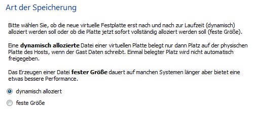

Wählen Sie „dynamisch alloziert“ aus.
Klicken Sie anschließend „Weiter“ an (nicht im Bild zu sehen).

Bestimmen Sie den Dateinamen der virtuellen Festplatte und legen Sie deren Größe fest:

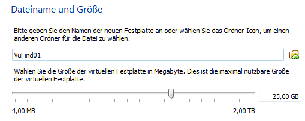

Tippen Sie in das Eingabefeld „25,00 GB“ ein. Ohne die Angabe der Einheit „GB“ kann VirtualBox die Eingabe nicht interpretieren.
Klicken Sie anschließend „Erzeugen“ an (nicht im Bild zu sehen).

Die Virtuelle Maschine wird erzeugt und in der Liste der Virtuellen Maschinen in VirtualBox angezeigt:

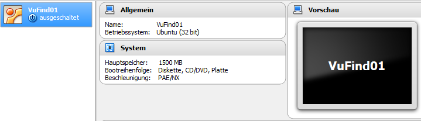

Starten Sie die Virtuelle Maschine durch Anwahl des grünen Pfeils „Starten“:

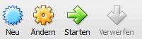

Die Virtuelle Maschine öffnet sich in einem eigenen Fenster. In diesem wird der Dialog „Medium für Start auswählen“ angezeigt:

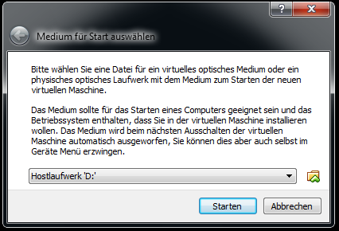

Klicken Sie auf das Symbol rechts. Es öffnet sich das Dateisystem Ihres Rechners. Wechseln Sie auf Ihren Desktop und wählen Sie dort die Installationsdatei für Xubuntu aus.

Diese Datei wird nun als Medium angezeigt:

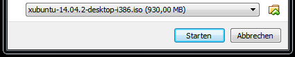

Klicken Sie „Starten“ an.

Nach kurzer Zeit erscheint der Schriftzug „Xubuntu 14.04“ auf schwarzem Hintergrund und es werden viele Informationen als Text angezeigt. Anschließend wird das Fenster mit der Virtuellen Maschine vergrößert.

Es erscheint der Startbildschirm der Installation. Stellen Sie darin die Sprache auf Deutsch um:

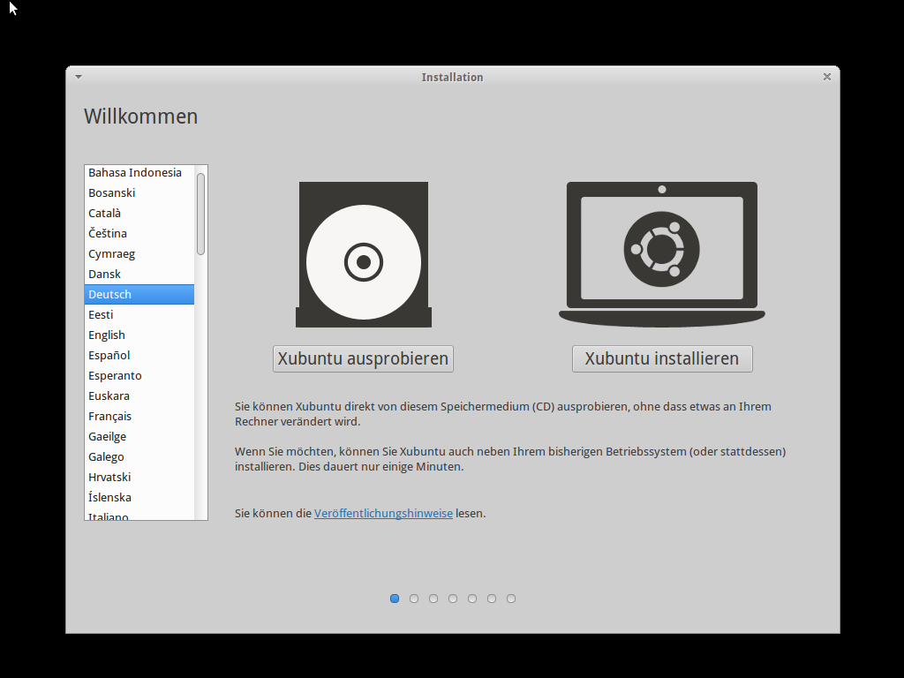

Klicken Sie „Xubuntu installieren“ an.

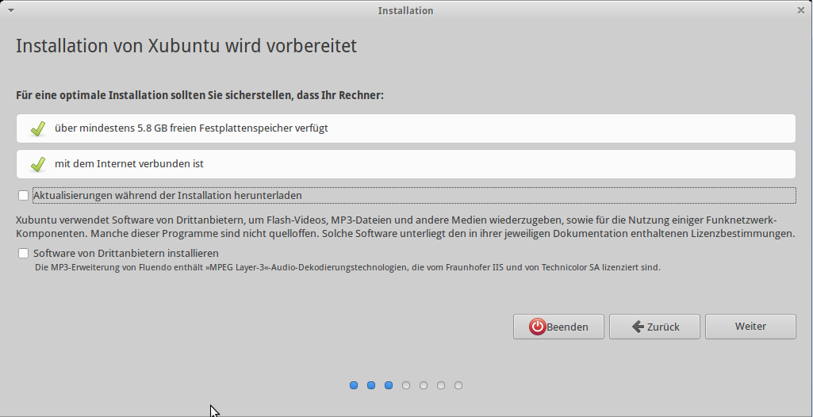

Die beiden angebotenen Optionen „Aktualisierungen während der Installation herunterladen“ und „Software von Drittanbietern“ sollten nicht ausgewählt werden. Die Aktualisierungen für das System können später separat durchgeführt werden. Software von Drittanbietern wird für den späteren Betrieb von VuFind nicht benötigt.
Klicken Sie „Weiter“ an.

Im nächsten Dialog wird die Installationsart abgefragt:

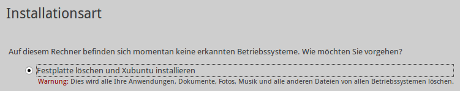

Die ausgewählte Option „Festplatte löschen und Xubuntu installieren“ ist optimal. Gemeint ist die Festplatte der Virtuellen Maschine und diese kann für die Installation gefahrlos gelöscht werden.
Klicken Sie „Jetzt installieren“ an (nicht im Bild zu sehen).

Es erscheint ein Popup-Fenster:

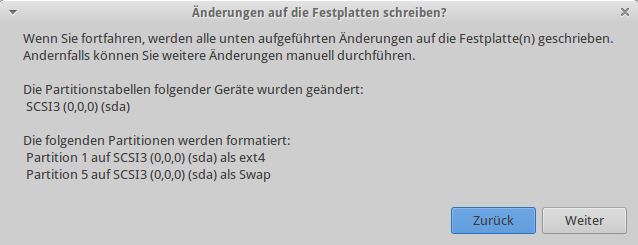

Klicken Sie „Weiter“ an.

Im nächsten Dialog „Wo befinden Sie sich?“ (ohne Abbildung) stellen Sie die Zeitzone ein. Diese sollte „Berlin“ sein. Klicken Sie anschließend „Weiter“ an.

Nun wählen Sie die Tastaturbelegung aus (ohne Abbildung). Wählen Sie in der Liste auf der linken Seite „Deutsch“ aus. In der Liste auf der rechten Seite wählen Sie ebenfalls „Deutsch“ aus. Klicken Sie anschließend „Weiter“ an.

Der nächste Dialog fragt „Wer sind Sie?“:

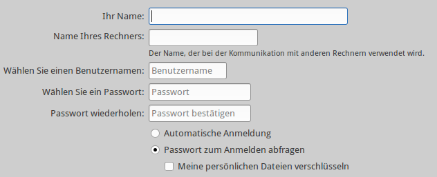

Füllen Sie die Felder entsprechend aus:

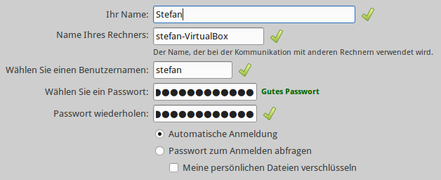

Die Felder „Name Ihres Rechners“ und „Wählen Sie einen Benutzernamen“ werden anhand der Angabe in „Ihr Name“ vorbelegt. Diese Vorbelegung sollten Sie i.d.R. nicht ändern. Wenn Sie bei jeder Anmeldung Ihr Passwort eingeben möchten, wählen Sie „Passwort zum Anmelden abfragen“ aus und ansonsten „Automatische Anmeldung“. Zusätzlich können Sie Ihre persönlichen Daten verschlüsseln.
Klicken Sie anschließend „Weiter“ an.

Die Installation startet und informiert während des Verlaufs über die aktuell stattfindenden Aktionen.

Das Ende der Installation wird gemeldet:

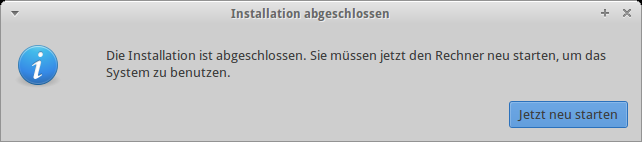

Klicken Sie „Jetzt neu starten“ an.

Während des Neustarts werden Sie zum Entfernen des Installationsmediums aufgefordert:

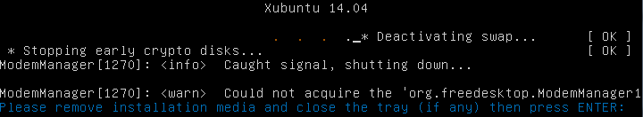

Da ein virtuelles Installationsmedium in Form einer ISO-Datei verwendet wurde, ist weder ein zu entfernendes Medium noch eine Schublade vorhanden.
Drücken Sie „Enter“.

Xubuntu startet nun und es erscheint der Desktop. Das Startmenü befindet sich oben links, daneben ist die Taskleiste. Dort sollte bereits nach wenigen Sekunden die „Aktualisierungsverwaltung“ erscheinen.

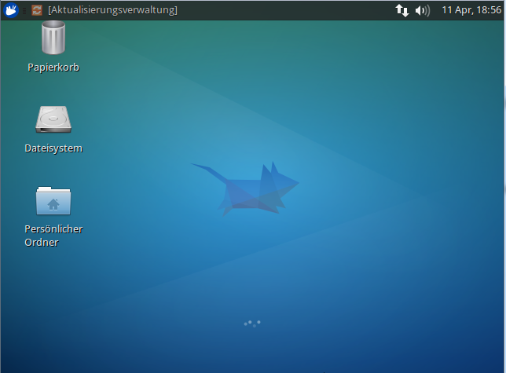

Klicken Sie die „Aktualisierungsverwaltung“ an.

Die Aktualisierungsverwaltung öffnet sich:

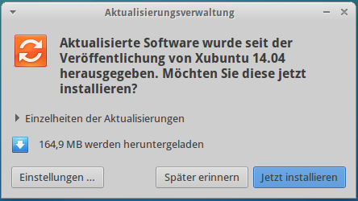

Klicken Sie „Jetzt installieren“ an.

Kurz nach dem Beginn der Aktualisierung erscheint eine Sicherheitswarnung:

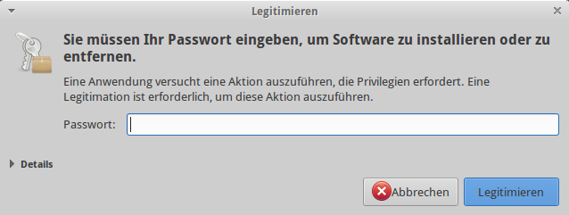

Geben Sie Ihr Passwort ein und klicken Sie anschließend „Legitimieren“ an.

Die Aktualisierung startet. Um Informationen zu den stattfindenden Aktion anzuzeigen, klicken Sie auf „Details“. Nach Abschluss der Aktualisierung muss Xubuntu möglicherweise nochmals neu gestartet werden.

Während der Aktualisierung wird Ihnen auffallen, dass sich die Bildschirmauflösung von Xubuntu nicht vergrößern lässt. Um dieses Problem zu beheben, sollten Sie die sogenannten „Gasterweiterungen“ installieren.

## Gasterweiterungen installieren

Das Fenster, in welchem VirtualBox Ihnen den Desktop von Xubuntu anzeigt, hat ein eigenes Menü mit den Menüpunkten „Maschine“, „Anzeige“, „Geräte“ und „Hilfe“:

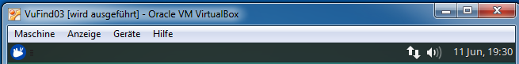

Wählen Sie aus dem Menü „Geräte“ den Menüpunkt „Medium mit Gasterweiterungen einlegen…“ aus:

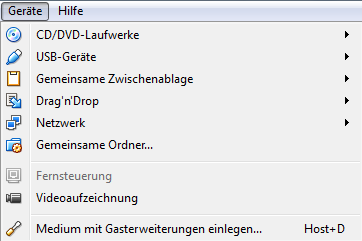

Dadurch wird virtuell eine CD in das CD-Laufwerk von Xubuntu eingehängt (dieser Vorgang nennt sich „Mounten“). Als Bestätigung für das erfolgreiche Einhängen, wird für kurze Zeit der Text „CD wurde eingehängt“ eingeblendet (ohne Abbildung). Anschließend wird der Inhalt der CD im Dateimanager von Xubuntu angezeigt (ohne Abbildung).
Schließen Sie den Dateimanager.

Das Startmenü von Xubuntu befindet sich in der linken oberen Ecke hinter dem blauen Symbol. Öffnen Sie das Startmenü und wählen Sie die Anwendung „Terminal“ aus:

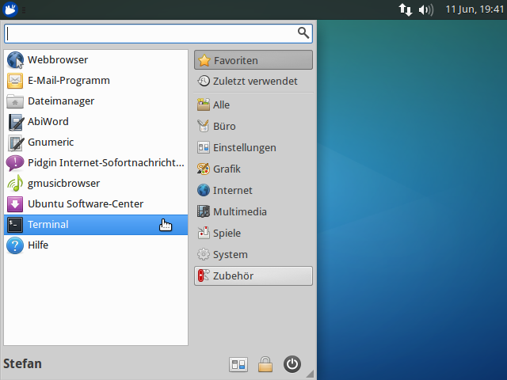

Das Terminal öffnet eine sogenannte Kommandozeile. Dort können Sie Systembefehle mit der Tastatur eingeben:

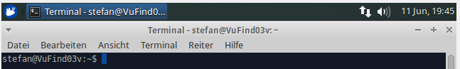

Tippen Sie im Terminal diesen Befehl ein und führen diesen durch Drücken der Enter-Taste aus:

```
sudo apt-get install dkms
```

  --------- ----------------------------------------------------------------------------------------------------------------------------------------------------------------
  **!!!**   Achten Sie bei allen Eingaben unbedingt auf die korrekte Einhaltung der Groß- und Kleinschreibung. Im Unterschied zu Windows unterscheidet Linux diese streng.
  --------- ----------------------------------------------------------------------------------------------------------------------------------------------------------------

Nach Ausführung des Befehls erscheint diese Meldung im Terminal:

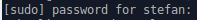

Geben Sie Ihr Passwort ein – die Eingabe selbst ist nicht sichtbar - und drücken Sie anschließend die Enter-Taste. Dadurch autorisieren Sie die Ausführung des Befehls „sudo“.
Der gesamte Befehl installiert eine notwendige Zusatzkomponente namens „dkms“. Während der Installation müssen Sie die Frage „Möchten Sie fortfahren \[J/n\]?“ (ohne Abbildung) mit Eingabe von „j“ bejahen.
Nach Abschluss der Installation erscheint wieder der blaue Cursor im Terminal.

Tippen Sie ins Terminal ```cd /media/``` gefolgt von Ihrem Benutzernamen und ```/VBOXADDITIONS_``` ein. Drücken Sie anschließend die Tabulator-Taste. Dadurch wird der Name der zuvor eingehängten CD ergänzt. Ihre Eingabe muss so ähnlich wie in der folgenden Abbildung aussehen:

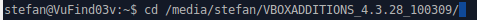

Drücken Sie nun die Enter-Taste.
Mit dem soeben ausgeführten Befehl wechseln Sie innerhalb des Terminal auf die eingehängte CD. (Das „cd“ im Befehl steht für „change directory“ und nicht für „Compact Disc“.)

Geben Sie diesen Befehl ein und führen Sie diesen aus:

```
sudo sh ./VBoxLinuxAdditions.run
```

Damit installieren Sie die Gasterweiterungen. Nach Abschluss der Installation erscheint wieder der Cursor. Tippen Sie exit ein, um das
Terminal zu schließen.


Öffnen Sie das Startmenü und klicken Sie in der rechten unteren Ecke den Ausschaltknopf an.

Es öffnet sich ein Fenster:

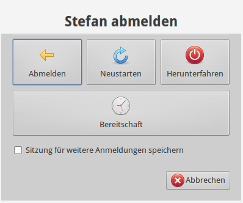

Klicken Sie „Herunterfahren“ an.

## Entfernen des Mediums mit den Gasterweiterungen

Wählen Sie in der Liste der Virtuellen Maschinen in VirtualBox den
Eintrag Ihrer Virtuellen Maschine aus.

Klicken Sie das gelbe Zahnrad für „Ändern“ an:


Es öffnen sich die Einstellungen:

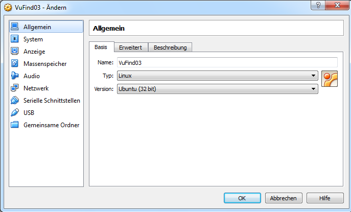

Wechseln Sie in den Menüpunkt „Massenspeicher“ und wählen Sie dort unter „Controller: IDE" den Eintrag „VBoxGuestAdditions.iso“ aus:


Klicken Sie auf das CD-Symbol rechts und wählen Sie in dem sich öffnenden Menü "Medium entfernen" aus:

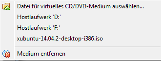

## Aktivieren der gemeinsamen Zwischenablage

Wechseln Sie in den Menüpunkt „Allgemein“ und wählen Sie den Reiter „Erweitert“ aus. Stellen Sie dort die „Gemeinsame Zwischenablage“ auf „bidirektional“ ein:


Anschließend können Sie Texte auf dem Host in die Zwischenablage kopieren und in Xubuntu verwenden oder umgekehrt.

## Setzen eines Sicherungspunktes

In VirtualBox können Sie sogenannte Sicherungspunkte setzen. Ein Sicherungspunkt speichert den aktuellen Zustand einer Virtuellen Maschine. Dadurch ist es zu einem späteren Zeitpunkt möglich, zu einem vorhandenen Sicherungspunkt zurückzukehren und die Virtuelle Maschine in einem früheren Zustand nutzen zu können.

Klicken Sie in VirtualBox auf den Button „Sicherungspunkte“:

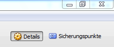

Es öffnet sich die Liste der vorhandenen Sicherungspunkte. Da Sie bisher keine Sicherungspunkte gesetzt haben, ist diese leer.

Der Zustand Ihrer Virtuellen Maschine, welcher über „Starten“ angesprochen wird, ist in der Liste der Sicherungspunkte immer mit „Aktueller Zustand“ beschrieben:

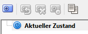

Klicken Sie das Symbol mit der Kamera an.

Es öffnet sich ein neues Fenster. Geben Sie einen Namen und eine Beschreibung für den Sicherungspunkt ein:

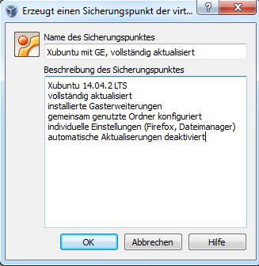

Klicken Sie anschließend „OK“ an (nicht im Bild zu sehen).

Die Liste der Sicherungspunkte sieht dann so aus:

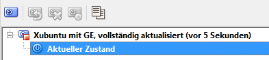

## Quellen

Creating a Xubuntu 14.04 Virtual Machine with VirtualBox. Version vom 03.10.2014.
<https://github.com/CERNatschool/getting-started/wiki/Creating-a-Xubuntu-14.04-Virtual-Machine-with-VirtualBox>