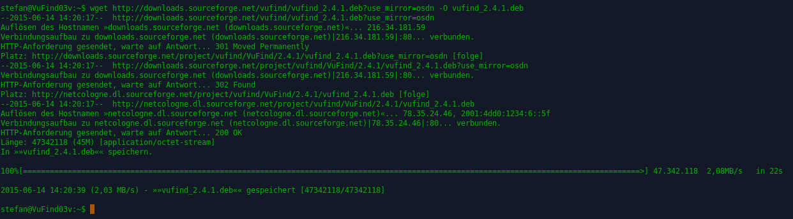
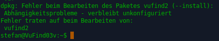
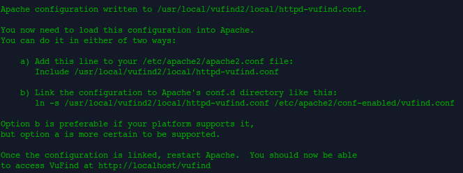
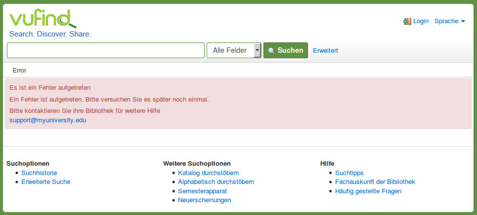
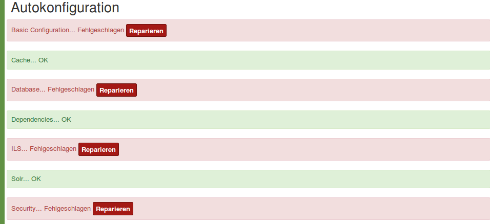
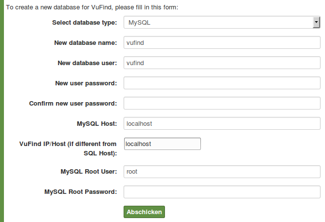
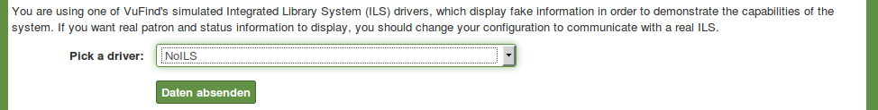
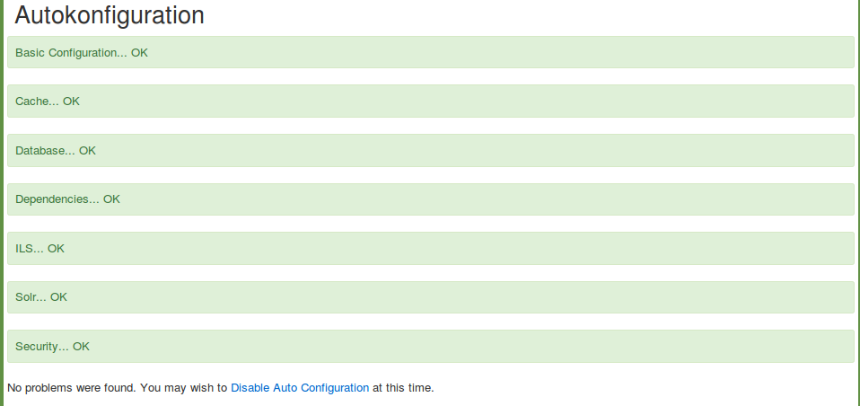

# Installation von VuFind

Für den Betrieb von VuFind werden diese Softwarekomponenten benötigt:

* Webserver (Apache),
* Suchindex (Solr),
* Programmiersprache (PHP) und
* Datenbank (MySQL).

Optional kann ein Integriertes Bibliothekssystem an VuFind angebunden werden. (Dies ist nicht Bestandteil des Tutorials.)

## Aktualisierung des Betriebssystems

Vor der Installation sollte Xubuntu auf den aktuellsten Stand gebracht werden.

Führen Sie folgenden Befehl im Terminal aus:

```
sudo apt-get update
```

Führen Sie danach diesen Befehl aus:

```
sudo apt-get dist-upgrade
```

Anschließend sollte das System neu gestartet werden:

```
sudo shutdown –r now
```

## Download des Installationspaketes

Stellen Sie sicher, dass Sie die im Terminal eingegebenen Befehle im Kontext des Standardverzeichnisses Ihres Benutzers ausführen. Dieses Verzeichnis wird Homeverzeichnis genannt. In diesem Tutorial verwenden wir den Benutzer „stefan“ und dieser hat sein Homeverzeichnis unter dem Pfad ```/home/stefan/ ```.

Im Terminal erkennen Sie das Homeverzeichnis an einer Tilde mit Dollar-Zeichen (```~$```), die vor dem Cursor angezeigt wird:


Führen Sie im Terminal folgenden Befehl aus:

```
wget http://downloads.sourceforge.net/vufind/vufind_2.4.1.deb?use_mirror=osdn -O vufind_2.4.1.deb
```

Die Installationsdatei (ein sogenanntes Paket) wird in Ihr Homeverzeichnis heruntergeladen:



## Installation des Paketes

Führen Sie diesen Befehl im Terminal aus:

```
sudo dpkg -i vufind_2.4.1.deb
```

Dieser Befehl installiert VuFind. Zunächst wird diese Installation jedoch mit einer Fehlermeldung abgebrochen, weil nicht alle für VuFind benötigten Pakete (sogenannte abhängige Pakete) installiert sind. Bei den abhängigen Paketen handelt es sich um die in der Einleitung beschriebenen Softwarekomponenten.



Sie müssen daher zunächst alle abhängigen Pakete installieren. Danach wird automatisch VuFind installiert.

Führen Sie folgenden Befehl aus:

```
sudo apt-get install –f
```

Der Befehl installiert die abhängigen Pakete und gibt zahlreiche Informationen im Terminal aus. Zu Beginn wird ermittelt, welche abhängigen Pakete tatsächlich neu installiert werden müssen. Der Installation müssen Sie mit der Antwort „j“ auf die Frage „Möchten Sie fortfahren? \[J/n\]“ zustimmen. Während der eigentlichen Installation werden weitere Informationen ausgegeben.

Für die Installation von MySQL wird die Angabe eines Root-Kennwortes erfragt:


Aus Sicherheitsgründen sollten Sie dieses Kennwort vergeben. Notieren Sie sich das Kennwort, da es für die spätere Konfiguration von VuFind benötigt wird. Es erscheint ein weiteres Fenster (ohne Abbildung), in welchem Sie die Eingabe des Kennworts wiederholen müssen.

Danach wird die Installation fortgesetzt und wiederum Informationen im Terminal ausgegeben.

Am Ende der Installation erscheint im Terminal ein Hinweis auf eine erforderliche Verlinkung zwischen VuFind und dem Apache-Webserver:



Diesen Hinweis können Sie ignorieren.

Starten Sie Firefox. (Dieser befindet sich unter „Startmenü &gt; Internet &gt; Firefox Web Browser“.) Rufen Sie die Webseite <http://localhost/vufind> auf. Nach kurzer Zeit erscheint die Startseite von VuFind:



Das Erscheinen der Startseite zeigt, dass die Verlinkung zwischen VuFind und dem Apache-Webserver bereits vorhanden ist. Der Hinweis „Es ist ein Fehler aufgetreten“ bedeutet in diesem Fall, dass VuFind noch nicht gestartet wurde. Dies wird im nächsten Schritt geschehen.

## Erste Konfiguration und Start von VuFind

Führen Sie im Terminal diesen Befehl aus:

```
source /etc/profile.d/vufind.sh
```

Durch den Befehl wird ein Skript ausgeführt, welches sogenannte Umgebungsvariablen erstellt. Diese werden zum Betrieb von VuFind benötigt und enthalten jeweils den Pfad zur Java-Instanz, zum Hauptverzeichnis von VuFind sowie zum Verzeichnis mit Ihren lokalen Einstellungen für VuFind.

Wechseln Sie in das Hauptverzeichnis von VuFind:

```
cd /usr/local/vufind2/
```

Starten Sie VuFind:

```
./vufind.sh start
```

In dem Terminal-Fenster, in welchem Sie VuFind gestartet haben, werden beim Start und während der weiteren Nutzung von VuFind zahlreiche Statusinformationen ausgegeben.

  --------- --------------------------------------------------------------------------------------------
  **!!!**   Benutzen Sie für alle übrigen Aktionen im Terminal ab sofort ein zweites Terminal-Fenster.
  --------- --------------------------------------------------------------------------------------------

Aktualisieren Sie die noch im Firefox geöffnete Startseite von VuFind:


Der Fehlerhinweis wird nicht mehr angezeigt und VuFind wurde somit erfolgreich gestartet.

Öffnen Sie nun ein zweites Terminal und führen Sie nacheinander folgende Befehle aus:

```
sudo php5enmod mcrypt
sudo service apache2 restart
```

Dadurch wird ein für den Betrieb von PHP benötigtes Modul namens „Mcrypt“ korrekt nachinstalliert und anschließend der Webserver (apache2) neu gestartet.

Öffnen Sie in Firefox die Seite <http://localhost/vufind/Install/Home>.

Angezeigt wird die Autokonfiguration von VuFind:



Klicken Sie den Schalter „Reparieren“ hinter „Basic Configuration“ an. Dies wird quittiert mit „Your configuration has been successfully updated.“

Beim Reparieren von „Database“ erscheint eine Eingabemaske:



Geben Sie in das Feld „New user password“ ein Kennwort ein. Wiederholen Sie dieses Kennwort im Feld „Confirm new user password“. Notieren Sie sich das Kennwort.
Geben Sie im Feld „MySQL Root Password“ das während der VuFind-Installation vergebene Root-Kennwort für MySQL.
Klicken Sie anschließend „Abschicken“ an.

Beim Reparieren von „ILS“ erscheint ebenfalls eine Eingabemaske:



Wählen Sie „NoILS“ aus der Liste aus.
Klicken Sie anschließend „Daten absenden“ an.

  --------- ---------------------------------------------------------------------------------------------------------------------------------------------------------
  **!!!**   Alternativ können Sie Ihr Lokalsystem aus der Liste wählen und es konfigurieren. Beachten Sie jedoch, dass dies nicht Bestandteil dieses Tutorials ist.
  --------- ---------------------------------------------------------------------------------------------------------------------------------------------------------

Klicken Sie abschließend den Schalter „Reparieren“ im Bereich „Security“ an.

Am Fuß der Seite erscheint nun ein Link zum Abschalten der Autokonfiguration:



Klicken Sie „Disable Auto Configuration“ an.
Dies wird mit „Auto configuration has been successfully disabled.“ quittiert.

Wechseln Sie ins Terminal. Ersetzen Sie im folgenden Befehl „stefan“ durch Ihren Benutzernamen und führen Sie den Befehl aus:

```
sudo chown –R stefan:stefan /usr/local/vufind2/local/config
```

Dieser Befehl sorgt dafür, dass Ihr Benutzer zum Besitzer des Verzeichnisses\ ```/usr/local/vufind2/local/config```wird. Das Verzeichnis enthält die lokale Konfiguration für VuFind (mehr dazu bei der Konfiguration).

Öffnen Sie im Dateimanager den Pfad ```/usr/local/vufind2/local/config/vufind/```. Öffnen Sie darin die Datei ```NoILS.ini```mit der Anwendung „Mousepad“.

Ändern Sie darin die Zeile

```
mode = ils-offline
```

in

```
mode = ils-none
```

Die Einstellung „ils-offline“ ist für Wartungsarbeiten gedacht. Die Einstellung „ils-none“ signalisiert VuFind, dass tatsächlich kein Lokalsystem angebunden ist.

## Sicherungspunkt in VirtualBox setzen

Fahren Sie nun Xubuntu herunter und setzen Sie in VirtualBox einen Sicherungspunkt namens „VuFind 2.4.1, bereit für Testimport“.

## Quellen

Installation Notes. VuFind Documentation.
<https://vufind.org/wiki/installation_readme>

Local Settings Directory. VuFind Documentation.
<https://vufind.org/wiki/vufind2:local_settings_directory>

VuFind 2.x on Ubuntu. VuFind Documentation.
<https://vufind.org/wiki/vufind2:installation_ubuntu>