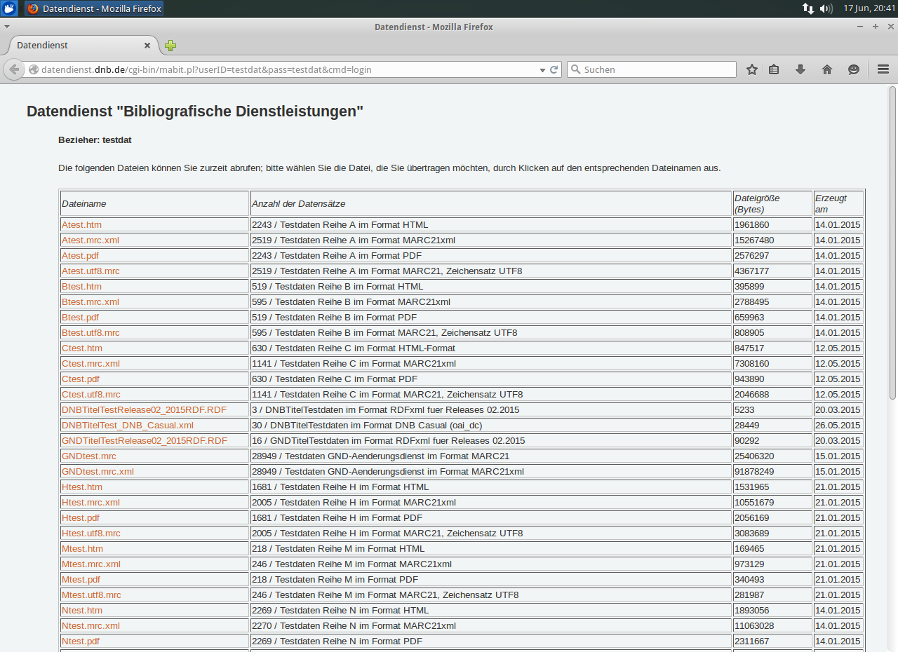
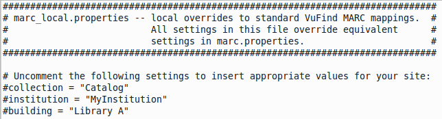
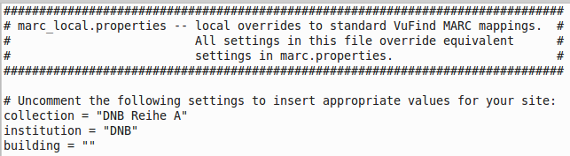
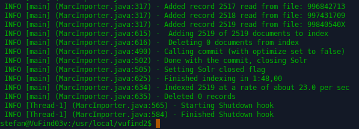
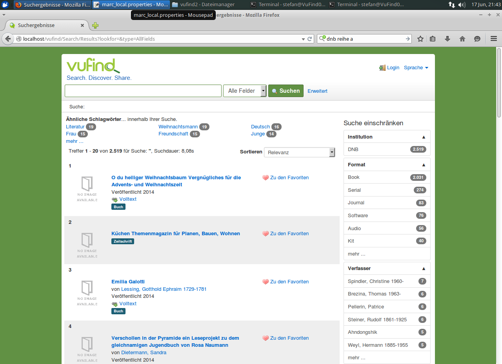

# Durchführung eines Testimports

Um VuFind und seine Funktionen erstmalig in Augenschein zu nehmen, empfiehlt sich die Durchführung eines Testimports. Dabei laden Sie Testdaten in den Suchindex von VuFind und lernen somit bereits, wie Sie einen ersten einfachen Datenimport durchführen. Gut geeignet für einen Testimport sind Testdaten der Deutschen Nationalbibliothek (DNB).

## Download von Testdaten

Öffnen Sie die Seite des „Datendienstes Bibliografische Dienstleistungen“ auf der Webseite der DNB:
<http://www.dnb.de/datendienst>

Wählen Sie dort (ohne Abbildung) den Link „Testdaten“ aus.
Es öffnet sich eine Liste mit den verfügbaren Testdaten:



Laden Sie die Datei ```Atest.utf8.mrc ```in das Verzeichnis ```Downloads ```Ihres Homeverzeichnisses herunter.

## Start von VuFind

Starten Sie VuFind:

```
cd /usr/local/vufind2\
./vufind.sh start
```

## Anpassung der Einstellungen für den Import

Öffnen Sie mit Mousepad die Datei ```marc_local.properties ```im Verzeichnis ```/usr/local/vufind2/import/ ```:



Editieren Sie die drei Werte „collection“, „institution“ und „building“ wie folgt:



Speichern Sie die Änderungen.

## Starten des Importes

Öffnen Sie ein weiteres Terminal:

```
cd /usr/local/vufind2
```

Starten Sie den Import:

```
./import-marc.sh /home/stefan/Downloads/Atest.utf8.mrc
```

(Achten Sie darauf, hierbei „stefan“ durch den Namen Ihres Benutzers zu ersetzen.)
Während des Importes wird für jeden Datensatz aus der Datei eine Statusmeldung in der Form „Added record 2519 from file:99840540X“ ausgegeben. Zum Abschluss meldet der Import unter anderem, wie viele Datensätze er dem Index hinzugefügt hat:



## Neustart von VuFind

Wechseln Sie nun in das erste Terminal. Drücken Sie die Enter-Taste, um einen Cursor sichtbar zu machen. Starten Sie VuFind neu:

```
./vufind.sh restart
```

## Suche in VuFind

Öffnen Sie VuFind in Firefox und starten Sie eine leere Suche, indem Sie den Suchschlitz leer lassen und einfach „Suchen“ anklicken.




Sie können unter anderem erkennen, dass alle 2.519 importierten Datensätze mit der leeren Suche gefunden wurden. Außerdem wird die Suchdauer mit 8,08 Sekunden angegeben. (Bei Ihnen kann dieser Wert abweichen.)

Die Suchdauer lässt sich verkürzen, indem Sie den Index optimieren.

## Index optimieren

Wechseln Sie in das Terminal, in welchem Sie den Datenimport durchgeführt haben:

```
cd util
php optimize.php
```

Die Optimierung läuft ohne Anzeigen im Terminal ab und ist beendet, wenn wieder ein Cursor im Terminal erscheint.

## Suche in VuFind

Führen Sie erneut eine leere Suche durch:


Die Suchdauer ist nun geringer geworden (hier: 2,23 Sekunden).

## Sicherungspunkt in VirtualBox setzen

Fahren Sie Xubuntu herunter und setzen Sie in VirtualBox einen weiteren Sicherungspunkt namens „mit geladenen Daten aus Testimport“.

## Weitere Informationen zum Datenimport

Bei jedem Datenimport werden die einzelnen Felder eines Datensatzes einem Indexfeld im Solr-Index zugeordnet. Dies geschieht mit Hilfe von Zuordnungsdateien wie der oben verwendeten ```marc_local.properties```. Eine Zuordnungsdatei steuert, welche Felder aus den zu importierenden Daten in welches Indexfeld im Solr-Index importiert werden.

Direkt in VuFind importieren können Sie Daten in den Formaten:

* MARC21 (binäres MARC),
* MARCXML und
* XML.

Für den Import von Daten in XML-Formaten sind größere Anpassungen erforderlich. Dies betrifft ebenfalls das Harvesting von Daten über OAI-PMH ein. Innerhalb des Tutorials werden wir uns ausschließlich mit dem Datenimport in den beiden MARC-Formaten beschäftigen.

## Quellen

Java Tuning. VuFind Documentation.
<https://vufind.org/wiki/performance>

MARC Records. VuFind Documentation.
<https://vufind.org/wiki/importing_records>

Starting and Stopping VuFind. VuFind Documentation.
<https://vufind.org/wiki/starting_and_stopping_vufind>