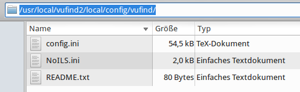

# Überblick zur Konfiguration

Diese Themen werden wir in den Kapiteln zur Konfiguration von VuFind
behandeln:

* Allgemeine Einstellungen
* Anpassung der Katalogoberfläche
* Konfiguration der Facetten
* Konfiguration von Kataloganreicherungen
* Konfiguration der Suche

Weitere Möglichkeiten zur Konfiguration werden in der VuFind-Dokumentation beschrieben (siehe unten im Abschnitt „Weiterführende Informationen“).

Bevor wir uns mit der eigentlichen Konfiguration beschäftigen, sind einige Vorbereitungen notwendig.

## Vorbereitung für die Konfiguration

Für die Konfigurationsdateien von VuFind gibt es ein globales und ein lokales Verzeichnis. Das globale Verzeichnis befindet sich unter dem Pfad ```/usr/local/vufind2/config/```. Das lokale Verzeichnis befindet sich unter ```/usr/local/vufind2/local/config```. Befindet sich eine Konfigurationsdatei auch im lokalen Verzeichnis, so wird für den entsprechenden Teil der Konfiguration die Datei aus dem lokalen Verzeichnis verwendet. Sie sollten alle Konfigurationsdateien, in welchen Sie Veränderungen vornehmen möchten, in das lokale Verzeichnis kopieren.

Während des Tutorials werden wir mit den Dateien ```config.ini```und ```facets.ini```arbeiten. Die Datei ```config.ini```ist die zentrale Konfigurationsdatei von VuFind. Die Datei ```facets.ini```enthält Einstellungen zu den Facetten.

Öffnen Sie im Dateimanager das Verzeichnis ```/usr/local/vufind2/local/config/vufind/```:



Die Dateien ```config.ini```und ```NoILS.ini```wurden während der Installation beim Schritt „Autokonfiguration“ angelegt.

Kopieren Sie die Datei ```facets.ini```aus dem Verzeichnis ```/usr/local/vufind2/config/vufind/```in das Verzeichnis ```/usr/local/vufind2/local/config/vufind/```.

## Quellen

Local Settings Directory. VuFind Documentation.
<https://vufind.org/wiki/vufind2:local_settings_directory>

## Weiterführende Informationen

Configuration and Customization (VuFind 2.x). VuFind Documentation.
<https://vufind.org/wiki/vufind2:configuration_and_customization>