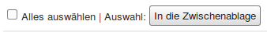
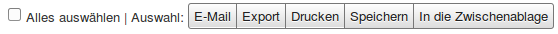
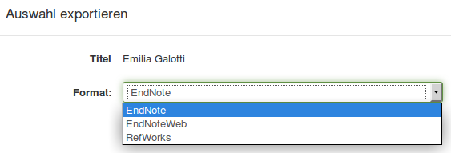
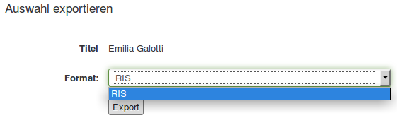
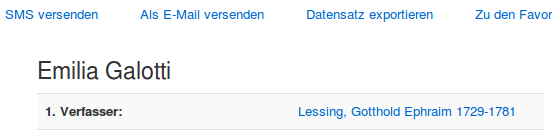
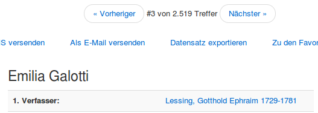

# Allgemeine Einstellungen

Die allgemeinen Einstellungen von VuFind sind in der Datei ``` config.ini```untergebracht. Sie sollten Änderungen an der Konfiguration nur innerhalb der Datei in Ihrem lokalen Konfigurationsverzeichnis durchführen. Die Konfigurationsdatei ist in sich dokumentiert und besteht aus Abschnitten. Die Namen der Abschnitte stehen in eckigen Klammern.

Im Folgenden werden einige allgemeine Einstellungen kurz näher vorgestellt. Um diese Einstellungen durchzuführen, müssen Sie die ```config.ini ```mit Mousepad bearbeiten.

## E-Mail und Titel

Diese Einstellungen finden sich im Abschnitt „\[Site\]“.

```
email = stefan.niesner@smail.fh-koeln.de
title = "MALIS14"
```

## Sprache und Zeitzone

```
Language = de
Locale = de_DE
Timezone = "Europe/Berlin"
```

## Merkliste

Um die Funktion der Merkliste zu aktivieren

```
showBookBag = true
```

In der mitgelieferten deutschen Übersetzung wurde die Funktionalität der Merkliste mit “Zwischenablage” übersetzt. Im weiteren Verlauf dieser Anleitung wird erklärt, wie Sie Übersetzungen anpassen können.

## Mehrfachauswahl

Ist die Merkliste aktiviert, erscheint diese unter anderem als Möglichkeit bei der Mehrfachauswahl von Treffern:



Um weitere Möglichkeiten anzubieten, aktivieren Sie diese Option:

```
showBulkOptions = true
```



## Exportformate

Die Exportformate werden im Abschnitt „\[Export\]“ eingeschaltet oder ausgeschaltet. In der Werkseinstellung sind RefWorks, EndNote und EndNoteWeb aktiviert. MARC, MARCXML, RDF, BibTeX und RIS (Research Information System Format) sind deaktiviert:



Um zum Beispiel RIS als einziges Exportformat anzubieten müssen Sie diese Einstellungen vornehmen:

```
RefWorks = false
EndNote = false
EndNoteWeb = false
RIS = true
```



## Navigation innerhalb der Einzeltreffer

In der Werkseinstellung wird ein Einzeltreffer so angezeigt, dass keine Navigation zum vorherigen oder nächsten Treffer aus der Trefferliste möglich ist:



Um diese Navigation einzuschalten, aktivieren Sie die folgende Einstellung innerhalb des Abschnitts „\[Record\]“:

```
next_prev_navigation = true
```




## Übersetzungen

Die Übersetzungen für Elemente von VuFind werden über Konfigurationsdateien im Verzeichnis ```/usr/local/vufind2/languages/```gesteuert. Die Datei für Deutsch ist ```de.ini```. Innerhalb der Datei steht jede Zeile für eine Übersetzung in der Form

```
Book Bag = "Zwischenablage"
```

Die Übersetzung hinter dem Gleichheitszeichen muss in Anführungszeichen stehen.

Um Übersetzungen anzupassen, sollten Sie im lokalen Konfigurationsverzeichnis ebenfalls eine ```de.ini``` anlegen. Wechseln Sie dazu im Dateimanager in das Verzeichnis ```/usr/local/vufind2/local```und erstellen Sie dort ein neues Verzeichnis namens ```languages ```. Erstellen Sie in diesem Verzeichnis eine neue, leere Datei namens ```de.ini```und öffnen Sie diese mit Mousepad.

Wie weiter oben im Abschnitt „Merkliste“ angemerkt ändern wir nun den Begriff „Zwischenablage“ in „Merkliste“.

Fügen Sie dazu die folgenden Zeilen in Ihre Sprachdatei ein:

```
Add to Book Bag = "In die Merkliste"
Book Bag = "Merkliste"
bookbag_confirm_empty = "Wollen Sie ihre Merkliste wirklich leeren?"
bookbag_delete = "Auswahl aus der Merkliste löschen"
bookbag_email = "Auswahl der Merkliste per E-Mail versenden"
bookbag_export = "Auswahl der Merkliste exportieren"
bookbag_full_msg = "Ihre Merkliste ist voll"
bookbag_is_empty = "Ihre Merkliste ist leer"
bookbag_save = "Auswahl der Merkliste speichern"
Empty Book Bag = "Merkliste leeren"
items_added_to_bookbag = "Auswahl wurde der Merkliste hinzugefügt"
items_already_in_bookbag = "Auswahl ist bereits in der Merkliste vorhanden"
Remove from Book Bag = "Aus der Merkliste entfernen"
View Book Bag = "Merkliste ansehen"
Your book bag is empty = "Ihre Merkliste ist leer"
```

  --------- ----------------------------------------------------------------------------------------
  **!!!**   Achten Sie unbedingt darauf, dass alle Zeilen in der Datei alphabetisch sortiert sind.
  --------- ----------------------------------------------------------------------------------------

Innerhalb von VuFind werden die Einstellungen für die Übersetzungen vererbt. Einträge für eine Sprache im lokalen Sprachverzeichnis erhalten dabei den Vorrang gegenüber Einträgen in der Standardsprachdatei. Dies hat den zusätzlichen Vorteil, dass die Standardsprachdatei als Referenz genutzt werden kann. Um eine bestimmte Übersetzung anzupassen, identifizieren Sie diese zuerst in der Standardsprachdatei. Dann kopieren Sie diese Einträge einfach in Ihre lokale Sprachdatei und passen die Übersetzung wie gewünscht an.

Nach der Anpassung führen Sie diese Befehle im Terminal aus:

```
cd /usr/local/vufind2/local/cache
sudo rm –rf languages
```

Der zweite Befehl löscht das Verzeichnis mit dem Cache für die Sprachinformationen.

Anschließend werden die angepassten Übersetzungen in VuFind angezeigt.

## Quellen

Language / Localization Support. VuFind Documentation.
<https://vufind.org/wiki/vufind2:language_localization_support>