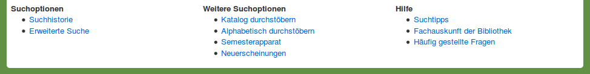
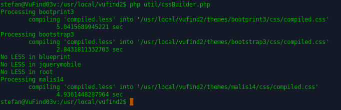
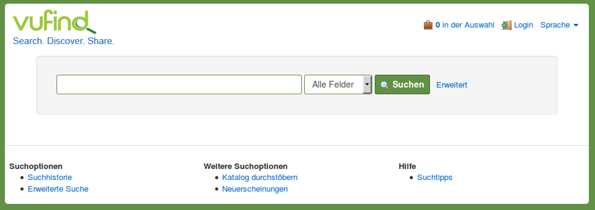
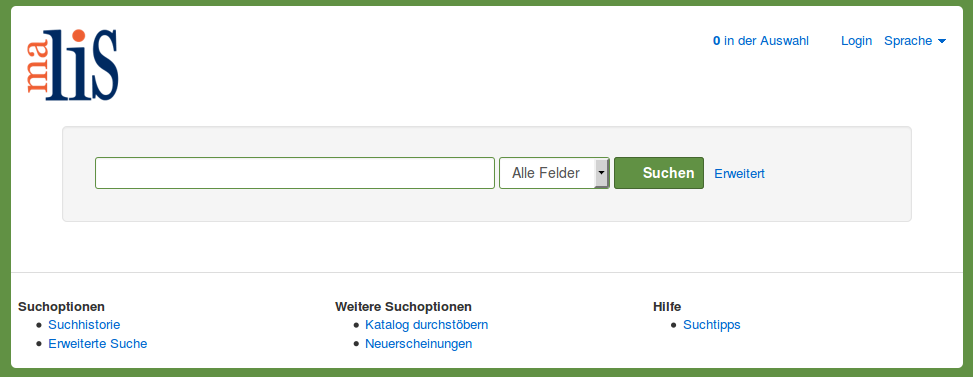

# Anpassung der Katalogoberfläche

Die Gestaltung der Katalogoberfläche basiert auf sogenannten Templates. Es gibt HTML-Templates für den Aufbau einer Seite und CSS-Templates für das Layout. Die HTML-Templates enthalten außerdem Programmcode in der Skriptsprache PHP, in welcher die Webseiten von VuFind programmiert sind. Alle Templates zusammen werden als Theme bezeichnet.

In diesem Kapitel werden wir ein eigenes Theme anlegen, den Footer von VuFind anpassen und das VuFind-Logo gegen ein eigenes Logo austauschen. Diese Schritte sollen Ihnen exemplarisch ein Grundverständnis für die Anpassung des Themes von VuFind geben.

## Eigenes Theme anlegen

Öffnen Sie im Dateimanager das Verzeichnis ```/usr/local/vufind2/themes/```.

Erstellen Sie darin ein neues Verzeichnis mit dem von Ihnen gewünschten Namen für Ihr eigenes Theme. (Hier werden wir den Namen „malis14“ für unser Theme verwenden.)

Erstellen Sie in diesem Verzeichnis eine neue Datei namens ```theme.config.php```und öffnen Sie diese Datei in Mousepad.

Fügen Sie folgenden Code ein:

```
<?php
return array(
    'extends' => 'bootprint3'
);
```

Dies veranlasst VuFind dazu, alle in Ihrem Theme nicht definierten Templates durch entsprechende Templates aus dem Theme „bootprint3“ zu ersetzen. Das Theme „bootprint3“ ist das Standard-Theme von VuFind.

## Theme für VuFind konfigurieren

Öffnen Sie die Datei ```config.ini```aus Ihrem lokalen Konfigurationsverzeichnis und passen Sie darin im Abschnitt „\[Site\]“die Zeile

```
theme = bootprint3
```

wie folgt an

```
theme = malis14
```

## Anpassung des Footers

Legen Sie im Verzeichnis Ihres Themes ein neues Verzeichnis ```templates```an.

Wechseln Sie zum Verzeichnis ```/usr/local/vufind2/themes/bootstrap3/templates/```. Kopieren Sie daraus die Datei ```footer.phtml```in das Verzeichnis ```templates```Ihres Themes.

Öffnen Sie anschließend die Datei mit Mousepad.

Löschen sie diese beiden Zeilen

```
<li><a href="<?=$this->url('alphabrowse-home')?>"><?=$this->transEsc('Browse Alphabetically')?></a></li>
<li><a href="<?=$this->url('search-reserves')?>"><?=$this->transEsc('Course Reserves')?></a></li>
```

Löschen Sie dann diese beiden Zeilen

```
<li><a href="#"><?=$this->transEsc('Ask a Librarian')?></a></li>
<li><a href="#"><?=$this->transEsc('FAQs')?></a></li>
```

Speichern Sie anschließend die Datei.

Durch die Löschungen wurde die Möglichkeit zum Aufruf der Funktionen „Alphabetisch durchstöbern“ („Browse Alphabetically“), Semesterapparat („Course Reserves“), „Fachauskunft der Bibliothek“ („Ask a Librarian“) und „Häufig gestellte Fragen“ („FAQs“) auf der Startseite von VuFind entfernt. Diese Funktionen werden wir innerhalb des Tutorials nicht konfigurieren.

**Footer vor der Anpassung**



**Footer nach der Anpassung**


## Änderung des Logos über dem Suchschlitz

Erstellen Sie im Verzeichnis Ihres Themes ein neues Verzeichnis namens ```images```. Legen Sie dort das gewünschte Logo ab. In unserem Fall ist das die Datei ```malis.png```.

Kopieren Sie aus dem Verzeichnis ```/usr/local/vufind2/themes/bootprint3/```das Verzeichnis ```less```und alle darin enthaltenen Dateien in das Verzeichnis Ihres Themes.

Wechseln Sie in das Verzeichnis ```less```und öffnen Sie darin die Datei ```bootprint.less```mit Mousepad.

Suchen Sie (Strg + F) den untenstehenden Abschnitt und ändern Sie die hier grün markierten Zeilen ab:

```
header {
  margin-top:18px;
  .fa.fa-bars {font-size:21px}
  .navbar {
    border-radius:5px 5px 0 0;
    padding:0 10px;
    #searchForm {display:none !important}
    .navbar-brand {
      background-image:url('../../images/malis.png');
      color:transparent;
      height:100px;
      margin-top:5px;
      width:100px;
      &:hover,&:active,&:focus {
        color:transparent;
      }
    }
```

Unter „background-image“ tragen Sie den Pfad Ihres Bildes ein. Die Angaben bei „height“ und „width“ müssen den tatsächlichen Abmessungen Ihres Bildes in Pixeln sein. Das hier verwendete Bild ist 100 Pixel hoch und 100 Pixel breit.

Führen Sie diese Befehle im Terminal aus:

```
cd /usr/local/vufind2/
php util/cssBuilder.php
```

Der zweite Befehl baut aus den Dateien im Verzeichnis „less“ jedes Themes (!!!) eine neue Datei namens ```compiled.css```im Unterverzeichnis ```css```zusammen:



Wenn Sie anschließend in Firefox die VuFind-Startseite neu aufrufen, wurde das bisher dort sichtbare VuFind-Logo durch Ihr Logo ersetzt. Dieses Logo wird auch auf allen Unterseiten von VuFind angezeigt.

**Startseite vorher**



**Startseite nachher**



## Quellen

User Interface Customization (VuFind 2.x). VuFind Documentation.
<https://vufind.org/wiki/vufind2:customizing_the_user_interface>

Using LESS. VuFind Documentation.
<https://vufind.org/wiki/using_less>