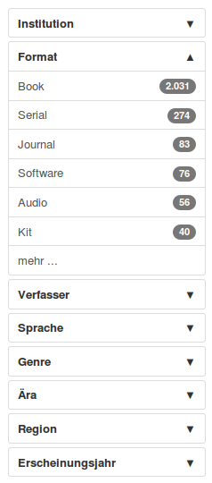
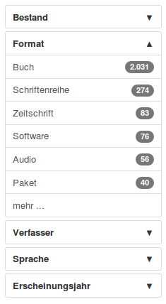
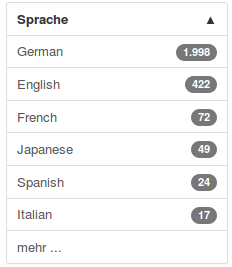
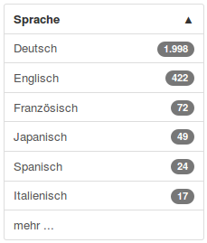

# Konfiguration der Facetten

Die Facetten innerhalb von VuFind basieren auf einzelnen Indexfeldern im Solr-Index. Die Anzeige und das Verhalten der Facetten in VuFind werden durch Einstellungen in der Datei ```facets.ini```gesteuert.

## facets.ini

Öffnen Sie die Datei ```facets.ini```aus Ihrem lokalen Konfigurationsverzeichnis mit Mousepad.

Der mit „\[Results\]“ beginnende Abschnitt enthält die Facetten. Jede Zeile enthält einen Eintrag in der Form

```
SolrIndexName = Anzeigename der Facette
```

Der Anzeigename selbst ist in englischer Sprache und wird innerhalb von VuFind übersetzt.

Einträge mit einem Semikolon am Beginn der Zeile sind ausgeblendet und werden nicht dargestellt.

Die Reihenfolge innerhalb von VuFind entspricht der Reihenfolge innerhalb des Abschnitts „\[Results\]“. Möchten Sie die Facetten in einer anderen Reihenfolge anzeigen lassen, sortieren Sie einfach die entsprechenden Zeilen in der Datei ```facets.ini```um.

## Ausblenden von Facetten

Blenden Sie die Facetten für Institution und Gebäude aus:

```
;institution = Institution
;building = Library
```

Blenden Sie die Facette für die Signatur (callnumber-first) aus:

```
;callnumber-first = "Call Number"
```

Blenden Sie die Facetten für Genre, Ära und Region aus:

```
;genre_facet = Genre
;era_facet = Era
;geographic_facet = Region
```

## Hinzufügen von Facetten

Fügen Sie eine Facette für den Bestand als erste Facette hinzu:

```
collection = Collection
```

## Übersetzung des Inhalts der Facette „Format“

Schalten Sie die Übersetzung für den Inhalt der Facette „Format“ ein:

```
translated_facets[] = format
```

**Facetten vor der Anpassung**



**Facetten nach der Anpassung**



## Übersetzung des Inhalts anderer Facetten

Grundsätzlich können die Inhalte aller Facetten übersetzt werden.

Zunächst müssen Sie analog zur Facette „Format“ definieren, dass eine bestimmte Facette übersetzt werden soll. Dies geschieht durch einen Eintrag, der mit ```translated_facets[] =``` beginnen muss und dem der Name des Indexfeldes folgen muss, auf welchem die Facette basiert.

Für die Sprache wäre dies also

```
translated_facets[] = language
```

Nun müssen Sie alle Inhalte identifizieren, welche in der Facette erscheinen könnten. Für die Sprache sind dies die Bezeichnungen der jeweilige Sprache auf Englisch.

Gehen Sie analog zum Kapitel „Übersetzungen“ in der Anleitung für die allgemeinen Einstellungen vor und tragen Sie die gewünschten Übersetzungen in Ihre lokale Sprachdatei ein. Für die häufigsten sechs Sprachen aus den Daten des Testimportes sind diese Einträge erforderlich:

```
German = "Deutsch"
English = "Englisch"
French = "Französisch"
Japanese = "Japanisch"
Spanish = "Spanisch"
Italian = "Italienisch"
```

  --------- -------------------------------------------------------------------------------------------------------------------------------------
  **!!!**   Achten Sie unbedingt darauf, keine typographischen Anführungszeichen zu verwenden. Diese werden als Teil der Übersetzung angesehen.
  --------- -------------------------------------------------------------------------------------------------------------------------------------

**Vor der Anpassung**



**Nach der Anpassung**



## Quellen

Facets. VuFind Documentation.
<https://vufind.org/wiki/adding_facets>

Working wiith Facets. VuFind Documentation.
<https://vufind.org/wiki/working_with_facets>
