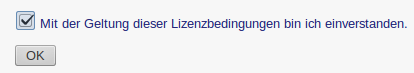
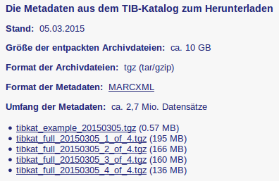
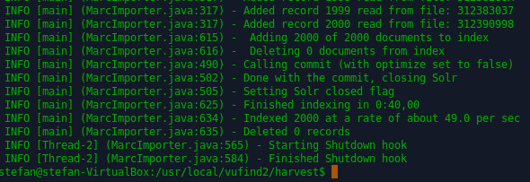
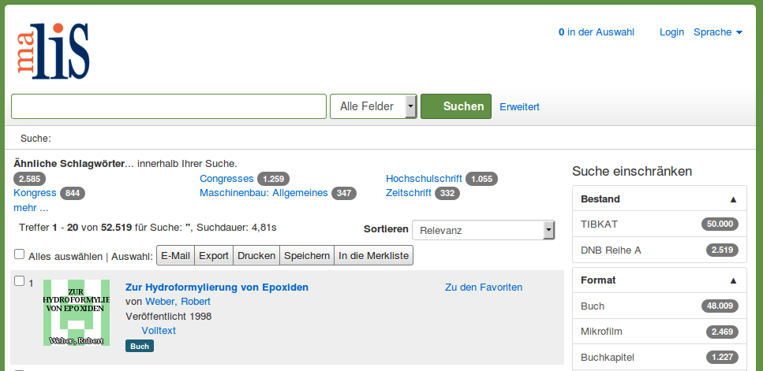

# Datenimport MARC21 MARCXML

In diesem Kapitel nutzen wir exemplarisch Daten aus dem TIBKAT der Technischen Informationsbibliothek. Diese stehen als sogenannte Open Data zur Verfügung.

## Download

Öffnen Sie die Webseite des Open Data Service der TIB:
<http://www.tib-hannover.de/de/dienstleistungen/opendata/download/4/>

Lesen Sie die Lizenzbedingungen und bestätigen Sie diese:



Wählen Sie „OK“ aus.

Auf der nächsten Seite werden eine Beispieldatei und die Daten selbst zum Download angeboten:




Laden Sie die erste Datei ```tibkat_full_20121030_1_of_4.tgz```in das Verzeichnis ```Downloads```in Ihrem Homeverzeichnis herunter.

## Entpacken

Entpacken Sie die heruntergeladene Datei in das Verzeichnis ```/usr/local/vufind2/local/harvest/```. Wählen Sie dazu die Datei im Dateimanager aus und klicken Sie dann im Kontextmenü „Entpacken nach…“ (ohne Abbildung) an. Die Archivdatei enthält ein Verzeichnis namens ```tibkat_full_20150305_1_of_4```. In diesem Verzeichnis befinden sich die Daten in einzelnen MARCXML-Dateien. Jede Datei enthält 2.000 Datensätze.

Da wir uns im Rahmen des Tutorials mit dem Import vertraut machen wollen, werden wir nur insgesamt 50.000 Datensätze importieren.

Erstellen Sie im Verzeichnis ```/usr/local/vufind2/local/harvest/```ein neues Verzeichnis namens ```TIBKAT```. Kopieren Sie die ersten 25 XML-Dateien aus dem Verzeichnis ```tibkat_full_20150305_1_of_4 ```in das Verzeichnis ```TIBKAT```.

## Import vorbereiten

Öffnen Sie mit Mousepad die Datei ```marc_local.properties``` im Verzeichnis ```/usr/local/vufind2/import/```. Ändern Sie die beim Testimport editierten Werte „collection“ und „institution“ wie folgt:

```
collection = "TIBKAT"
institution = "TIB"
```

## Import durchführen

Starten Sie VuFind.

Führen Sie im Terminal die folgenden Befehle aus:

```
cd /usr/local/vufind2/harvest/
./batch-import-marc.sh TIBKAT
```

Der zweite Befehl startet den Import. Dieser verarbeitet nacheinander die einzelnen XML-Dateien und meldet den Import jedes Datensatzes im Terminal:



Während des Importes werden die importierten Dateien in ein Verzeichnis
namens ```processed```verschoben. Wird der Import nach einer Unterbrechung fortgesetzt, werden do die Dateien im Ordner ```processed```nicht nochmals importiert.

## VuFind neu starten und Index optimieren

Starten Sie VuFind neu.

Optimieren Sie den Index.

## Import kontrollieren

Führen Sie eine leere Suche in VuFind durch:



Anhand der Facette „Bestand“ können Sie sehen, dass zu den 2519 Datensätzen aus der DNB-Reihe A nun 50.000 Datensätze aus dem TIBKAT hinzugekommen sind.

## Quellen

MARC Records. VuFind Documentation.
<https://vufind.org/wiki/importing_records>