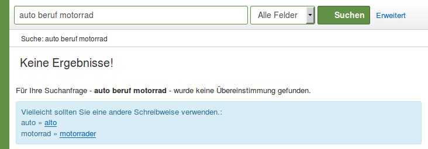

# Konfiguration der Suche, Teil II

Dieser Teil der Suche setzt voraus, dass Sie den Datenimport im vorherigen Kapitel durchgeführt haben.

## Synonyme

Suchen Sie in Vufind nach dem Suchterm „kfz“:


Suchen Sie anschließend nach dem Suchterm „auto“:


Gehen Sie wie im Folgenden beschrieben vor, um die Suchterme „kfz“ und „auto“ bei der als Synonyme zu definieren.

Öffnen Sie im Verzeichnis ```/usr/src/vufind2/solr/biblio/conf/```die Datei ```synonyms.txt``` mit Mousepad.

Fügen Sie in die Datei folgende Zeile ein

```
Auto,auto,kfz,Kfz,KFZ
```

Speichern Sie die Datei und starten Sie VuFind neu.

Führen Sie die beiden Suchen nach „kfz“ und „auto“ erneut durch:


Für beide Suchterme ergeben sich nun 66 Treffer.

## Minimum Should Match

Mit der Einstellung „Minimum Should Match“ des DisMax Query Parser können Sie definieren, in welchem Umfang eingegebene Suchterme mit einem Datensatz im Index übereinstimmen müssen.

Führen Sie in VuFind eine Suche nach „auto beruf motorrad“ durch. Diese ergibt keine Ergebnisse:



Öffnen Sie im Verzeichnis ```/usr/src/vufind2/solr/biblio/conf/```die Datei ```solrconfig.xml```mit Mousepad.

Suchen Sie darin diese Zeile:

```
<requestHandler name="dismax" class="solr.SearchHandler">
```

Fügen Sie zwischen ```<str name="spellcheck.count">20</str>``` und  ```</lst>```die folgende Zeile ein:

```
<str name="mm">2&lt;-1 5&lt;-2 6&lt;90%</str>
```

Speichern Sie die Datei und starten Sie VuFind neu.

Bei Eingabe von 3 bis 5 Suchtermen darf ab sofort einer davon in den Treffern fehlen. Bei 6 Suchtermen dürfen 2 davon fehlen und bei mehr als 6 müssen 90% der eingegebenen Suchterme übereinstimmen.

Führen Sie die Suche nach „auto beruf motorrad“ nun erneut durch.


Das Suchergebnis enthält nun vier Treffer. Der in der Abbildung gezeigt Treffer enthält die Suchterme „Auto“ und „Motorrad“, aber nicht den Suchterm „Beruf“. Dies entspricht der konfigurierten Bedingung, dass bei 3 bis 5 Suchtermen einer der Suchterme in den Treffern fehlen darf.

## Quellen

Stop Words and Synonyms. VuFind Documentation.
<https://vufind.org/wiki/stop_ words_and_synonyms>

Schmitt, Jörg; Stehle, Marcel 2010: Der OPAC aus dem Baukasten. Realisierung eines Katalog 2.0 unter Einbeziehung der Community. Überarb. Version 1.0 31.12.2010. Hamburg: Hochschule für Angewandte Wissenschaften Hamburg. Department Information.
<http://edoc.sub.uni-hamburg.de/haw/volltexte/ 2011/1143/>